# RE:MEET (SSAFY 9기 자율프로젝트)

# A706 (팀명)

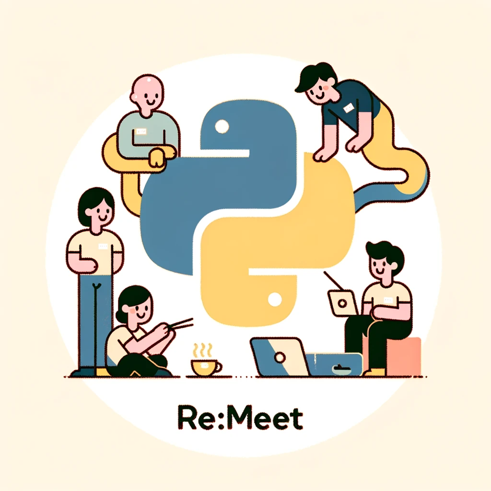

## **0️⃣프로젝트 개요**

🔵 프로젝트명 : **Re:Meet**🔵

🔹 프로젝트 컨셉 : 소중한 사람을 기록하고 다시 만나는 디지털 트윈

🛠 개발 기간 : 23.10.10 ~ 23.11.20 (6주)

🧑🏻 팀원 : 이승준, 김영우, 김승우, 황상미, 임병국, 이민웅

💻 사용 기술스택 : Java(SpringBoot), Python(Flask), React(TypeScript), AWS + (4. 시스템 아키텍처 참고)

## **1️⃣ 서비스 주요기능**

- STT(React-speech-recognition) : 사용자의 음성을 인식하고 대화를 텍스트로 변환합니다.
- LLM(ChatGpt) : ChatGPT를 활용하여 대화 프롬프트를 만들고 대화 응답을 만들어냅니다.
- TTS(ElevenLabs) : 사용자의 음성을 학습하여 목소리 모델을 만들고 응답 음성을 생성합니다.
- Face Generate AI(Heygen): 이미지를 기반으로 응답음성을 발화하는 얼굴영상을 생성합니다.

## **2️⃣ 서비스 세부 기능**

| 기능           | 주기능                                    | 상세 기능                                                                  |
| -------------- | ----------------------------------------- | -------------------------------------------------------------------------- |
| 1.User         | 1.1 회원가입                              | 사용자의 회원가입을 진햅합니다                                             |
|                | 1.2 아이디 중복확인                       | 아이디의 중복 여부를 체크합니다.                                           |
|                | 1.3 회원 탈퇴                             | 사용자의 회원탈퇴를 진햅합니다                                             |
|                | 1.4 로그인                                | 사용자의 로그인을 진행합니다.                                              |
|                | 1.5 로그아웃                              | 사용자의 토큰을 만료시킵니다.                                              |
|                | 1.6 개인정보조회                          | 사용자 정보를 제공합니다.                                                  |
|                | 1.7 토큰 재발급                           | ACCESS TOKEN 이 만료된 경우 헤더에 REFRESH TOKEN 을 넣어서 재발급 받습니다 |
| 2.ModelList    | 2-1. 대화 상대 전체 조회                  | 대화 상대리스트(대화 모델)를 조회합니다.                                             |
|                | 2-2. 대화 상대 상세 조회                  | 대화 상대리스트(대화 모델)의 상세 정보를 조회합니다.                                           |
|                | 2-3. 대화 상대 삭제                       | 대화 상대리스트(대화 모델)를 DB에서 삭제합니다                                             |
| 3.Modeling     | 3-1. 대화 상대 추가                  | 새로운 대화상대모델을 생성합니다                                             |
|                | 3-2. 대화 모델 학습음성 조회         | 대화모델의 음성학습에 사용된 음성파일을 조회합니다                                           |
|                | 3-3. 대화 모델 영상 조회                  | 대화모델의 기본영상으로 제공된 영상파일을 조회합니다                                             |
|                | 3-4. 보이스모델 생성 조회                 | 대화모델의 음성학습 완료여부를 확인합니다                                             |
|                | 3-5. heygen id 대상 조회             | 얼굴모델 학습필요대상 모델을 조회합니다                                             |
|                | 3-6. heygen id 생성 조회                  | 얼굴학습모델 생성 여부를 조회합니다                                             |
|                | 3-7. 기본,립싱크 영상생성 조회            | 대화모델의 기본영상생성 여부를 조회합니다.                                             |
| 4.Board        | 4-1. 최근 대화 영상 조회             | 사용자의 최근 대화 영상들을 조회합니다.                                             |
|                | 4-2. 특정 인물과 대화 영상 전체 조회 | 사용자가 선택한 대화모델과의 이전 대화들을 모두 조회합니다                           |
|                | 4-3. 대화 영상 삭제                  | 사용자가 선택한 대화모델과의 대화영상을 삭제합니다                                             |
| 5.Conversation | 5-1. 대화생성                        | 사용자가 대화를 시작하면 대화id를 생성합니다                                             |
|                | 5-2. STT(귀)                              | 사용자의 음성을 인식하여 Text로 변환합니다.                                           |
|                | 5-2-1. 질문 업로드                        | 사용자가 질문한 Text를 S3 DB에 업로드합니다                                             |
|                | 5-3. 음성 대화하기                        | 사용자가 질문한 Text에 대한 대답을 생성합니다.                                             |
|                | 5-4. 비디오로 대화하기                    | 사용자의 질문과 대답생성을 통한 대화를 영상으로 생성합니다.                           |
|                | 5-5. 대화 저장                            | 대화내역을 저장합니다.                                             |

## 3️⃣ 컴포넌트 구조

**FrontEnd**
```
├── api
├── assets
│   └── beep
├── components
│   ├── board
│   ├── common
│   ├── model
│   ├── navbar
│   ├── profile
│   ├── talk
│   └── videostroage
├── constants
├── hooks
├── pages
├── router
├── store
├── styles
├── types
└── utils
```
**BackEnd(springboot)**
```md
📂 src/main/java
  ㄴ📜 com.example.remeet
  	ㄴ📘 config
  	ㄴ📘 controller
    ㄴ📘 dto
    ㄴ📘 entity
    ㄴ📘 exception
    ㄴ📘 repository
    ㄴ📘 service
    ㄴ📘 util
📂 src/main/resources
    ㄴ📄 application.yml
📄 .gitignore
🐳 Docker-compose.yml
🐳 Dockerfile.spring
🐘 build.gradle
🐘 gradlew
🐘 gradlew.bat
🐘 settings.gradle
```
**BackEnd(flask)**
```md
📂 dev/Flask/
  ㄴ📙 conversation.py
  ㄴ📙 mergevideo.py
  ㄴ📄 .gitignore
  ㄴ🐳 Docker-compose.yml
  ㄴ🐳 Dockerfile.googlestt
  ㄴ🐳 Dockerfile.mergeflask
  ㄴ🐳 Dockerfile.conversation
  ㄴ📄 google.json
  ㄴ📄 nginx.conf
```

## 4️⃣ 시스템 아키텍처 및 DB 모델링(ERD)

<h3>System Architecture</h3>

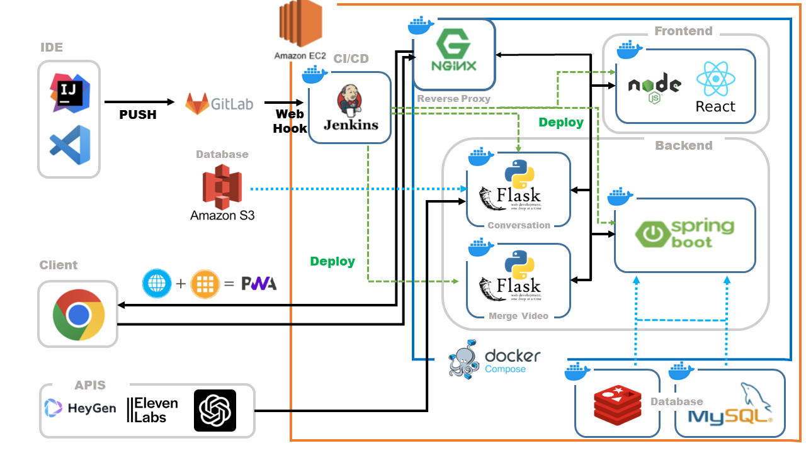

<h3>ERD</h3>

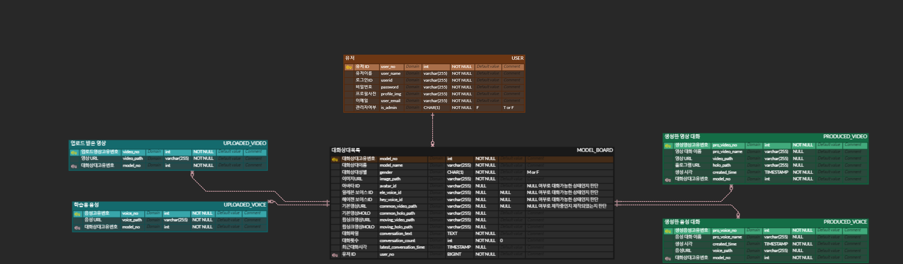

## 5️⃣ Convention

<details>
<summary>컨벤션 접기/펼치기</summary>

## ✔️ Branch Convention

- 브랜치 생성시 다음과 같은 방식으로 브랜치 목적에 맞는 브랜치 헤더를 설정한다.

| 생성 목적 | 브랜치 위치         |
| --------- | ------------------- |
| 기능 개발 | Feat {issue_number} |
| 버그 픽스 | Fix {issue_number}  |
| 예제      | Feat 188            |

```
issue_number: 해당 이슈가 진행되는 스프린트에서 할당받은 고유 이슈 번호
```

- 체계적인 분류를 위해 브랜치 이름을 통해 의도를 명확하게 드러낸다.

- 새로운 브랜치는 항상 최신의 develop 브랜치에서 만든다.

- develop 브랜치는 항상 최신의 상태로 유지한다.

### Git branch 사용법

- 현재 branch 확인<br/>
  `git branch`
- 새로운 branch 생성하기<br/>
  `git branch 브랜치명`
- branch 이동하기<br/>
  `git switch 브랜치명`
- branch를 생성하면서 이동하기<br/>
  `git switch -c 브랜치명`
- 변경사항 복원하기<br/>
  `git restore 파일명`
- branch 삭제하기<br/>
  `git branch -d 브랜치명`
- branch push하기<br/>
  `git push -u origin 브랜치명` (원격 레포지토리에 브랜치가 없을 때)<br/>
  `git push`

---

<br/>
<br/>

## ✔️ Commit Convention

### 1. Commit Message Structure

|   개요    |             설명             |
| :-------: | :--------------------------: |
| 작성 방법 | **`깃모지_내용_(이슈번호)`** |
|   예제    | :art:\_코드 수정\_([#234]()) |
|   코드    | **`:art:_코드 수정_(#234)`** |

### 2. Commit Type : 깃모지

- 필요 기능 발견 시 담당자에게 건의
- [참고](https://gitmoji.dev/) : IntelliJ, VSCode에서도 연동 가능

| 아이콘 |     코드     |           설명           |                  원문                   |
| :----: | :----------: | :----------------------: | :-------------------------------------: |
|   🎨   |   `:art:`    |  코드의 구조/형태 개선   | Improve structure / format of the code. |
|   🔥   |   `:fire:`   |      코드/파일 삭제      |          Remove code or files.          |
|   🐛   |   `:bug:`    |      **버그 수정**       |               Fix a bug.                |
|   ✨   | `:sparkles:` |       **새 기능**        |         Introduce new features.         |
|   📝   |   `:memo:`   |      문서 추가/수정      |      Add or update documentation.       |
|   💄   | `:lipstick:` | UI/스타일 파일 추가/수정 |  Add or update the UI and style files.  |

### 3. Commit Type : 내용

- 선택사항
- **`어떻게`** 보다는 **`'무엇을'`, `'왜'`** 변경했는 지에 대해 작성
- 72자를 넘기지 말기

### 4. Commit Type : 이슈번호

- 선택사항
- **`Issue Tracker ID`** 를 작성
- 여러 개의 이슈번호는 **`,`** 로 구분

<br/>
<br/>

## ✔️ Merge Convention

** MR(Merge Request) 생성**

- 피드백이나 도움이 필요할 때 그리고 merge 준비가 완료되었을 때 Merge Request를 생성한다.

- 동료들의 리뷰가 끝난 후 준비가 완료되었다면 develop 브랜치(or develop-(FE/BE))로 반영을 요구한다

- develop 브랜치로 merge될 경우 conflict를 작업 중인 브랜치에서 미리 해결하고 진행한다.

- MR 생성 시 예시

  - MR 제목

  | 생성 목적 | MR 제목                              |
  | --------- | ------------------------------------ |
  | 기능 개발 | [issue_number] issue_name            |
  | 버그 픽스 | [issue_number] issue_name (Fix)      |
  | 코드 개선 | [issue_number] issue_name (Refactor) |

  - 예시

  ```
  | 기능 개발 | [#22] 로그인기능 구현  |
  | 버그 픽스 | [#22] 로그인기능 구현 (Fix)  |
  | 코드 개선 | [#22] 로그인기능 구현 (Refactor)|
  ```

  - MR 설명

  ```
  - Merge Request 이유:
   - feature 병합 / 버그수정 / 코드 개선 등
  - 세부내용:
    - 왜 해당 MR이 필요한지 최대한 다른 사람이 알아볼 수 있도록 적기
  - Relevant issue number:
    - 관련된 이슈 넘버가 있으면 이곳에 기입해주세요, ex) #000, #000
  ```

<br>

### 0. 코드 리뷰할 때 주의사항

- **nit 줄이기** : 사소하고 작은 문제로 주로 스타일 가이드 준수, 가독성 개선 등을 의미 / 전체적으로는 중요하지 않지만 품질 향상에 도움이 될 수 있는 부분에서 사용
- **변경 사이즈 줄이기** : 리뷰할 내용이 커지면 코드 리뷰하기 부담

### 1. 코드 리뷰 방식

|  타입  | 개요                                                                  | 설명                                                                                                     |
| :----: | --------------------------------------------------------------------- | -------------------------------------------------------------------------------------------------------- |
| **P1** | 이번에 반드시 반영되어야 하는 중대한 코드 수정 의견 (Request Changes) | 버그 가능성이 있거나 잘못된 구현인 경우. 만약 반영되지 않는다면 이에 대한 반대 의견도 낼 수 있어야 한다. |
| **P2** | 적극적으로 이야기했으면 하는 의견 (Request Changes)                   | 잠재적인 이슈나 확장성을 고려해야 하는 경우. 토론하며 의견 조율할 수 있다.                               |
| **P3** | 가능하다면 반영해주었으면 하는 의견 (Comment)                         | 지금 구현보다 더 나은 방향이 있는 경우. 이번 반영이 어렵다면 다음 작업에서도 고려해볼 수 있도록 한다.    |
| **P4** | 다음에 반영 되도 되는 의견 (Approve)                                  | 반영이 되지 않거나 반대 의견을 적극적으로 할 필요 없다.                                                  |
| **P5** | 사소한 의견 (Approve)                                                 | 무시해도 됨. 혹은 관련 나누고 싶은 점 나눌 수 있다.                                                      |

</details>

## **6️⃣ 서비스 화면**

<details>
<summary>서비스 접기/펼치기</summary>
<h2>회원가입 및 로그인</h2>

- 회원가입

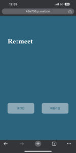

- 로그인

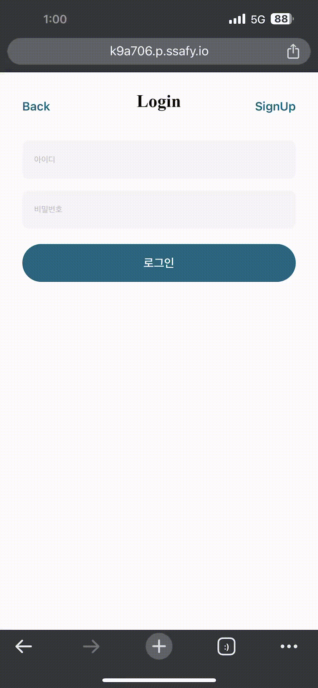

<h2>마이페이지</h2>

- 프로필 및 로그아웃

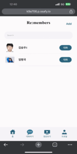

<h2>모델</h2>

- 모델 생성

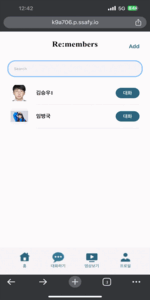

- 모델 삭제

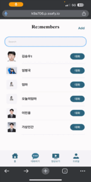

- 모델 검색

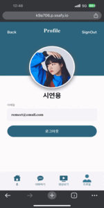

- 모델 확인

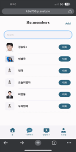

<h2>대화</h2>

- 음성 대화

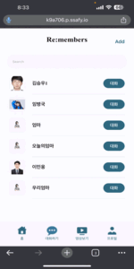

- 영상 대화

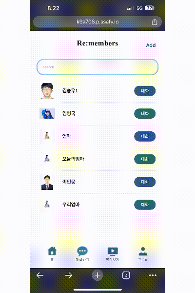

- 대화 저장

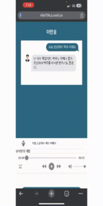

</details>

## **7️⃣ 프로젝트 회고**

| 이름   | 내용                                                                                                                                                                                                                                                                                                                                                                                                                                                                               |
| ------ | ---------------------------------------------------------------------------------------------------------------------------------------------------------------------------------------------------------------------------------------------------------------------------------------------------------------------------------------------------------------------------------------------------------------------------------------------------------------------------------- |
| 이승준 | Springboot와 Flask 두개의 서버를 함께 활용하는데 고려해야할 사항에 대해 경험했습니다. 회원 인증에 관련된 부분과 메인기능의 대다수가 Flask 서버에서 동작하여 서버간 통신에서 효율성을 고려하게 되었습니다. 처리 속도가 중요했던 서비스 기능에서 일정하지 못한 처리에 아쉬움이 남아 추후 각 파트별 시간 단축과 정확한 응답을 할 수있는 자체 AI 모델을 같이 개선해 나갈 수 있으면 좋겠다라는 생각을 남기게 되었습니다. |
| 김영우 | ffmpeg와 moviepy를 활용하여 영상을 병합하는 방법을 배웠습니다. Docker-compose에서 컨테이너끼리 내부 네트워크를 설정을 했습니다.  컨테이너 내부 통신으로 편집이 필요한 영상을 전송하고, 각 컨테이너 별로 리소스 관리를 하는 경험을 해볼 수 있는 프로젝트였습니다. 영상 처리 과정이 리소스를 많이 사용하여, EC2서버를 추가로 사용하여 오케스트레이션 할 수 있었으면 좋았겠다는 아쉬움은 남습니다. |
| 김승우 | STT를 활용할 기회와, Recoil, React-query를 이용하여 보일러 플레이트 코드를 줄일 수 있었습니다. 또한 컴포넌트 구조도가 개발 생산성을 향상시키는것에 큰 기여를 한다는 것을 다시한번 깨달을 수 있는 기회였습니다. 다음으로는 TypeScript의 기능들을 좀 더 활용하여 개발을 진행해보고 싶습니다. |
| 황상미 | Backend와 Frontend를 모두 경험해볼 수 있었던 좋은 기회였습니다. ERD 설계부터 UX/UI 디자인에까지 이르는 서비스 개발의 전과정에 참여함으로써 웹 서비스 개발 흐름을 이해할 수 있었고 여기에 AI기술까지 적용해봄으로써 한 단계 발전된 서비스를 제공해볼 수 있는 경험을 쌓을 수 있었습니다. 인공지능 모델을 웹 환경에 구축해 해당 서비스를 널리 배포하고 싶었던 저의 SSAFY 입과 목표가 이루어져 뜻깊은 프로젝트로 기억에 남을 것 같습니다.  |
| 임병국 | 이번 프로젝트에서 Flask를 사용한 웹 개발과 ChatGPT 프롬프트 엔지니어링을 통한 원하는 대답 생성 기능을 구현했습니다. ChatGPT 로 대화하는 것을 구현하기 위해 프롬프트 설계가 중요하다는 것을 알게되었습니다. 그와 관련하여 자연어 처리에 대한 이론을 학습하였으며 딥러닝에 대한 관심을 가지게 되었습니다. 하지만 API를 사용하다보니 세세한 부분들은 조정하지 못했다는 점에서 아쉬움이 남는다. 이후 프로젝트에서는 상세한 부분에 대해서는 내가 직접 수정할 수 있도록 open API 사용 대신에 모델을 직접 만들어 구현하고싶다. |
| 이민웅 |  JPA를 활용한 springboot 메인백엔드서버와 외부 API를 처리하기 위한 flask 서버를 함께 사용하여 서버간 통신을 통해 로직을 처리하는 경험을 했습니다. TTS 모델을 활용하여 음성데이터로 목소리 모델을 만들고 실시간 대화를 위한 모델학습 및 생성, 대화처리 API 설계경험을 했습니다. 추후 외부 API 의존성을 낮추고 AI 모델의 성능을 고도화하는 방향으로 프로젝트의 방향성을 잡고 추가적인 디벨롭의 필요성을 느꼈고, 기능을 세분화 하여 MSA 아키텍처 방식을 채택하는 방식도 고려해볼만한 선택이라고 생각합니다. |
